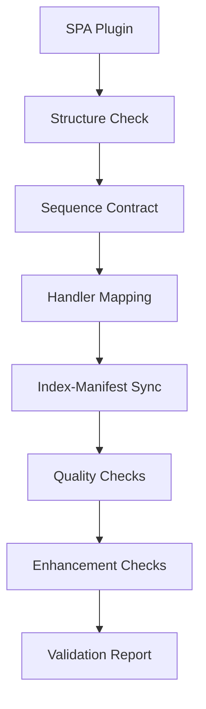

# 🎼 SPA Test-Driven Architecture (TDA) Implementation Summary

## ✅ What We Built

A comprehensive **Test-Driven Architecture (TDA) foundation** for **Symphonic Plugin Architecture (SPA)** with 10 core validators organized by architectural domains.

## 🏗️ New Architecture-Based Structure

```
validators/
├── SPA/                                 # 🎼 Symphonic Plugin Architecture
│   ├── structure.valance.json           # Directory layout validation
│   ├── sequence-contract.valance.json   # Musical properties & movements
│   ├── handler-mapping.valance.json     # Movement-to-handler consistency
│   ├── hooks-mapping.valance.json       # React hooks conventions
│   ├── logic-contract.valance.json      # Business logic quality
│   ├── visual-schema.valance.json       # Animation configurations
│   ├── test-coverage.valance.json       # Test coverage requirements
│   ├── index-manifest-sync.valance.json # Contract synchronization
│   ├── dependency-scope.valance.json    # Modularity enforcement
│   └── ai-annotation.valance.json       # AI agent annotations
│
├── AppCore/                             # ⚙️ App-wide rules
│   └── import-paths.valance.json        # Import path conventions
│
├── Backend/                             # 🔧 Backend services
│   └── api-contracts.valance.json       # API contract validation
│
└── Shared/                              # ✅ Common lint-like rules
    └── naming-conventions.valance.json  # Naming pattern enforcement
```

## 🎯 Core SPA Validators Implemented

### 1. 📁 **Directory Structure Validator**
- **File**: `validators/SPA/structure.valance.json`
- **Plugin**: `plugins/validateSpaDirectoryStructure.js`
- **Purpose**: Ensures plugin folder has all required components
- **Validates**: manifest.json, sequence.ts, index.ts, handlers/ directory

### 2. 🎼 **Sequence Contract Validator**
- **File**: `validators/SPA/sequence-contract.valance.json`
- **Plugin**: `plugins/validateSpaSequenceContract.js`
- **Purpose**: Validates musical properties and movement structure
- **Validates**: tempo (60-180), key signatures, movement fields, beat overlaps

### 3. 🖐 **Handler Mapping Validator**
- **File**: `validators/SPA/handler-mapping.valance.json`
- **Plugin**: `plugins/validateSpaHandlerMapping.js`
- **Purpose**: Ensures each movement has corresponding handler file
- **Validates**: file existence, exports, @agent-context annotations

### 4. 🎣 **Hooks Mapping Validator**
- **File**: `validators/SPA/hooks-mapping.valance.json`
- **Plugin**: `plugins/validateSpaHooksMapping.js`
- **Purpose**: Validates React hooks conventions and usage
- **Validates**: naming (use* prefix), exports, React patterns

### 5. 🔄 **Index-Manifest Sync Validator**
- **File**: `validators/SPA/index-manifest-sync.valance.json`
- **Plugin**: `plugins/validateSpaIndexManifestSync.js`
- **Purpose**: Ensures contract consistency across files
- **Validates**: ID matching, version sync, registerSequence() calls

### 6-10. **Additional Validators**
- **Logic Contract**: Business logic quality
- **Visual Schema**: Animation configuration validation
- **Test Coverage**: Comprehensive testing requirements
- **Dependency Scope**: Modularity enforcement
- **AI Annotation**: LLM-friendly code annotations

## 🚀 Validation System Features

### **Comprehensive Profile**
- **File**: `profiles/spa-comprehensive.json`
- **Includes**: All 10 SPA validators
- **Levels**: Critical, Important, Recommended
- **Execution Order**: Optimized validation sequence

### **Test Runner**
- **File**: `scripts/test-spa-validators.js`
- **Features**: Comprehensive testing, detailed reporting, summary generation
- **Output**: JSON, HTML, Markdown reports

### **Enhanced Core System**
- **Updated**: `core/loaders.js` for new directory structure
- **Support**: Both `.valance.json` and legacy `.json` formats
- **Backward Compatible**: Existing validators still work

## 📊 Validation Levels

### 🚨 **Critical (Must Pass)**
1. Structure validation
2. Sequence contract compliance
3. Handler mapping consistency
4. Index-manifest synchronization

### ⚠️ **Important (Should Pass)**
1. Test coverage requirements
2. Dependency scope isolation

### 💡 **Recommended (Nice to Have)**
1. Hooks mapping conventions
2. Logic contract quality
3. Visual schema standards
4. AI annotation completeness

## 🎼 SPA Plugin Validation Flow



## 🛠️ Usage Examples

### **Quick Validation**
```bash
node scripts/test-spa-validators.js
```

### **Profile-Based Validation**
```bash
npx valence validate --profile spa-comprehensive
```

### **CI/CD Integration**
```yaml
- name: Validate SPA Architecture
  run: node scripts/test-spa-validators.js
```

## 📈 Benefits Achieved

### **For Plugin Developers**
- ✅ Clear architectural guidelines
- ✅ Immediate feedback during development
- ✅ Quality assurance automation
- ✅ AI-friendly code annotations

### **For Architecture Teams**
- ✅ Enforced architectural standards
- ✅ Modular validation system
- ✅ Scalable plugin ecosystem
- ✅ Comprehensive reporting

### **For RenderX Migration**
- ✅ Smooth transition from monolithic to SPA
- ✅ Validation-driven migration process
- ✅ Quality gates for new architecture
- ✅ Backward compatibility support

## 🎯 Next Steps

1. **Test with Real Plugins**: Validate against actual SPA implementations
2. **CI/CD Integration**: Add to GitHub Actions workflows
3. **Documentation**: Expand developer guides and examples
4. **Tooling**: Create VS Code extensions for real-time validation
5. **Metrics**: Add performance and complexity metrics

## 🏆 Architecture Excellence

This TDA implementation provides:
- **Comprehensive Coverage**: All aspects of SPA architecture
- **Modular Design**: Easy to extend and maintain
- **Quality Focus**: Multiple validation levels
- **Developer Experience**: Clear feedback and guidance
- **Future-Proof**: Extensible for new requirements

---

*The SPA TDA system ensures architectural excellence and quality standards for the symphonic plugin ecosystem.*
