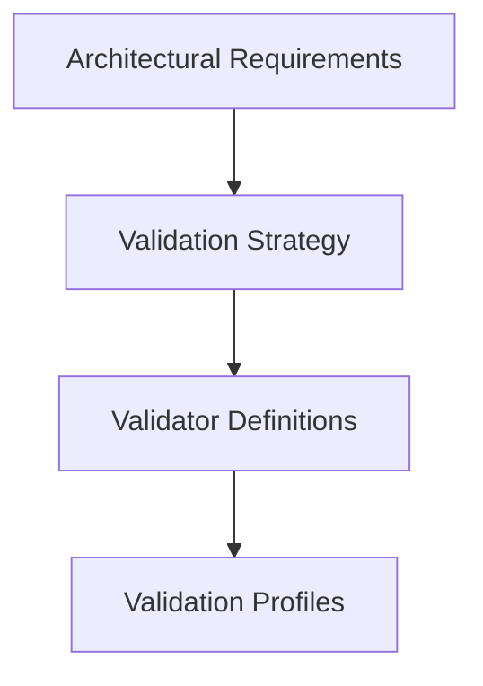
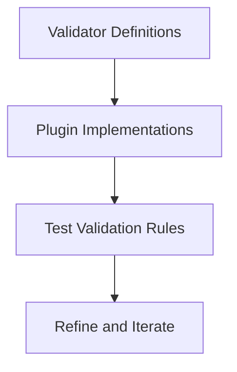
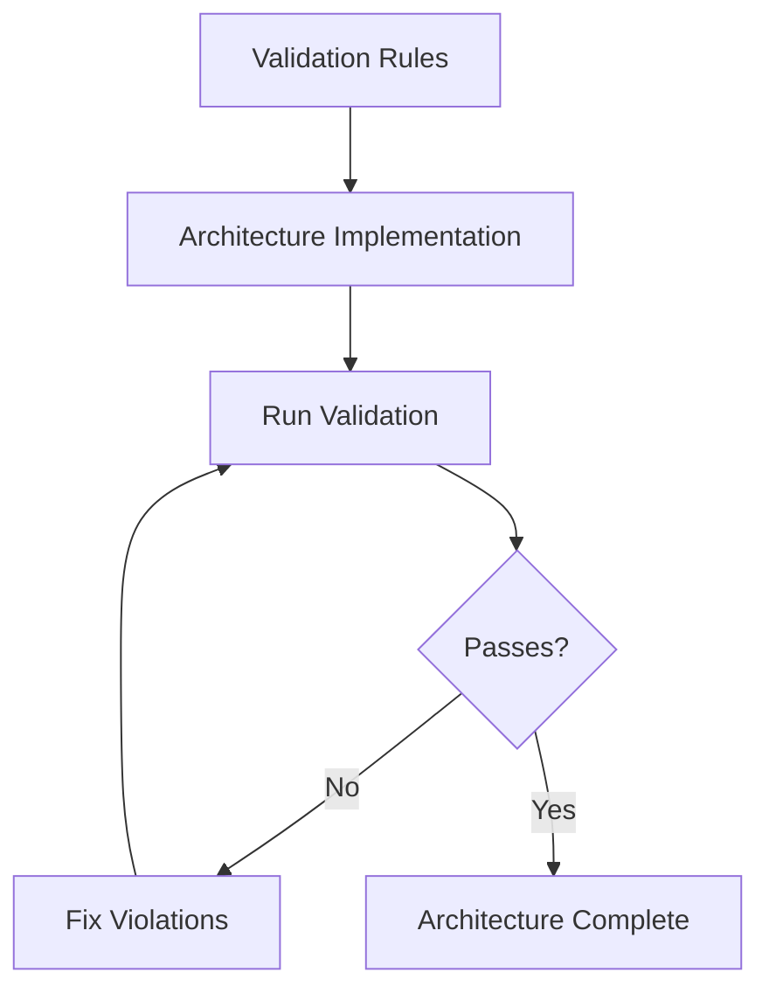

# 📐 Test-Driven Architecture (TDA)

## 🌟 Overview

**Test-Driven Architecture (TDA)** is a validation-driven architectural methodology that ensures architectural integrity through comprehensive validation rules. TDA applies the principles of Test-Driven Development to architectural design, where validation constraints drive implementation decisions and architectural quality.

## 🎯 Core Principles

### **1. Validation-First Design**
Define architectural validators before implementing the architecture:
```
1. Define architectural constraints → 
2. Implement validation rules → 
3. Build architecture to pass validation → 
4. Iterate and refine
```

### **2. Architectural Constraints Drive Implementation**
Let validation rules guide architectural decisions:
- **Structure**: Directory layouts and file organization
- **Contracts**: Interface definitions and API boundaries  
- **Quality**: Test coverage and code quality standards
- **Integration**: Component interaction patterns

### **3. Continuous Architectural Validation**
Integrate validation into development workflow:
- **Development**: Real-time feedback during coding
- **CI/CD**: Quality gates in build pipelines
- **Production**: Ongoing architectural health monitoring

## 🏗️ TDA Methodology

### **Phase 1: Define Architectural Vision**


**Steps:**
1. **Identify Architectural Goals**: What quality attributes matter?
2. **Define Validation Strategy**: How will we measure compliance?
3. **Create Validator Definitions**: What specific rules enforce our goals?
4. **Organize Validation Profiles**: How do we group and prioritize validators?

### **Phase 2: Implement Validation Rules**


**Steps:**
1. **Write Validator Definitions**: JSON configurations with rules
2. **Implement Validation Plugins**: JavaScript logic for validation
3. **Test Validation Rules**: Ensure validators catch violations correctly
4. **Refine Rules**: Adjust based on false positives/negatives

### **Phase 3: Build Architecture to Pass Validation**


**Steps:**
1. **Implement Architecture**: Build according to validation constraints
2. **Run Continuous Validation**: Check compliance during development
3. **Fix Violations**: Address issues identified by validators
4. **Iterate**: Refine both architecture and validation rules

## 🎼 TDA in Practice: SPA Architecture

### **SPA TDA Implementation**

#### **1. Architectural Vision**
- **Goal**: Modular, scalable plugin architecture using musical metaphors
- **Quality Attributes**: Modularity, consistency, testability, maintainability

#### **2. Validation Strategy**
```json
{
  "validationLevels": {
    "critical": ["structure", "contracts", "integration"],
    "important": ["quality", "modularity"],
    "recommended": ["conventions", "documentation"]
  }
}
```

#### **3. Validator Implementation**
```
validators/SPA/
├── structure.valance.json           # Directory layout validation
├── sequence-contract.valance.json   # Musical properties validation
├── handler-mapping.valance.json     # Movement-to-handler consistency
├── index-manifest-sync.valance.json # Contract synchronization
├── test-coverage.valance.json       # Quality assurance
├── dependency-scope.valance.json    # Modularity enforcement
├── hooks-mapping.valance.json       # React conventions
├── logic-contract.valance.json      # Business logic quality
├── visual-schema.valance.json       # Animation standards
└── ai-annotation.valance.json       # AI-friendly annotations
```

#### **4. Architecture Implementation**
Developers build SPA plugins that pass all validation rules:
- **Structure**: Follow required directory layout
- **Contracts**: Implement proper sequence definitions
- **Quality**: Maintain test coverage standards
- **Integration**: Ensure handler-movement alignment

## 🧠 TDA in Practice: CIA Architecture

### **CIA TDA Implementation**

#### **1. Architectural Vision**
- **Goal**: Runtime safety for plugin mounting and execution
- **Quality Attributes**: Reliability, resilience, graceful failure handling

#### **2. Validation Strategy**
```json
{
  "runtimeSafety": {
    "pluginValidation": "Required before mounting",
    "handlerValidation": "Required before execution", 
    "errorHandling": "Graceful failure on malformed plugins"
  }
}
```

#### **3. Validator Implementation**
```
validators/CIA/
├── plugin-interface-runtime.valance.json  # Plugin shape validation
├── handler-alignment-runtime.valance.json # Movement-handler alignment
├── mount-call-safety.valance.json         # Safe mounting signatures
├── plugin-loader-validation.valance.json  # Dynamic import safety
└── conductor-test-harness.valance.json    # Test coverage validation
```

#### **4. Architecture Implementation**
Conductor implementations that pass runtime safety validation:
- **Plugin Validation**: Check plugin shape before mounting
- **Error Handling**: Graceful failure for malformed plugins
- **Consistent Patterns**: Safe mounting signatures
- **Test Coverage**: Comprehensive error scenario testing

## 📊 Validation Levels in TDA

### **🚨 Critical (Must Pass)**
Fundamental architectural constraints that ensure system integrity:
- **Structure**: Core layout and organization requirements
- **Contracts**: Essential interface and API definitions
- **Integration**: Critical component interaction patterns

### **⚠️ Important (Should Pass)**
Quality attributes that significantly impact maintainability:
- **Test Coverage**: Quality assurance requirements
- **Modularity**: Dependency isolation and scope
- **Performance**: Efficiency and scalability constraints

### **💡 Recommended (Nice to Have)**
Enhancement patterns that improve developer experience:
- **Conventions**: Naming and style guidelines
- **Documentation**: Code clarity and AI annotations
- **Tooling**: Development workflow improvements

## 🔧 TDA Tools and Integration

### **Valence Confidence Engine Integration**
TDA leverages VCE for enhanced validation:
```json
{
  "confidenceThreshold": 0.8,
  "validationLevels": {
    "critical": { "minConfidence": 0.9 },
    "important": { "minConfidence": 0.8 },
    "recommended": { "minConfidence": 0.7 }
  }
}
```

### **CI/CD Integration**
```yaml
# .github/workflows/tda-validation.yml
name: TDA Architectural Validation
on: [push, pull_request]
jobs:
  validate-spa:
    runs-on: ubuntu-latest
    steps:
      - uses: actions/checkout@v3
      - run: node cli/cli.js --profile spa-comprehensive --files "plugins/**/*symphony*"
  
  validate-cia:
    runs-on: ubuntu-latest  
    steps:
      - uses: actions/checkout@v3
      - run: node cli/cli.js --profile cia-comprehensive --files "src/**/*conductor*"
```

### **Development Workflow**
```bash
# TDA development cycle
npm run tda:validate        # Run all architectural validation
npm run tda:spa             # Validate SPA architecture
npm run tda:cia             # Validate CIA architecture
npm run tda:reports         # Generate comprehensive reports
```

## 🎯 TDA Benefits

### **🏗️ Architectural Quality**
- **Consistency**: Enforced patterns across codebase
- **Integrity**: Validation ensures architectural compliance
- **Evolution**: Rules adapt as architecture matures
- **Documentation**: Validation rules serve as living documentation

### **🔧 Development Experience**
- **Early Feedback**: Catch architectural issues during development
- **Clear Guidelines**: Validation rules provide implementation guidance
- **Quality Gates**: Prevent architectural debt accumulation
- **Confidence**: High-confidence validation results

### **📈 Team Collaboration**
- **Shared Standards**: Common understanding of architectural requirements
- **Objective Metrics**: Measurable architectural quality
- **Knowledge Transfer**: Validation rules encode architectural knowledge
- **Scalability**: Consistent patterns enable team growth

## 🚀 Implementing TDA

### **1. Start with Core Validators**
Begin with critical architectural constraints:
```bash
# Create validator definitions
mkdir validators/MyArchitecture
touch validators/MyArchitecture/structure.valance.json
touch validators/MyArchitecture/contracts.valance.json
```

### **2. Define Validation Profile**
```json
{
  "name": "my-architecture-comprehensive",
  "validators": [
    "MyArchitecture/structure",
    "MyArchitecture/contracts"
  ],
  "validationLevels": {
    "critical": ["MyArchitecture/structure"],
    "important": ["MyArchitecture/contracts"]
  }
}
```

### **3. Implement Validation Logic**
```javascript
// plugins/MyArchitecture/validateStructure.js
export const validateStructure = (filePath, content, options) => {
  // Validation logic here
  return {
    success: true,
    violations: [],
    confidence: 0.95
  };
};
```

### **4. Integrate into Workflow**
```bash
# Run validation during development
node cli/cli.js --profile my-architecture-comprehensive --files "src/**/*"

# Add to CI/CD pipeline
node cli/cli.js --profile my-architecture-comprehensive --confidence-threshold 0.9
```

## 🎯 Best Practices

### **For Architecture Teams**
- **Start Simple**: Begin with core structural validators
- **Iterate Frequently**: Refine rules based on real usage
- **Document Rationale**: Explain why each validator exists
- **Monitor Trends**: Track validation results over time

### **For Development Teams**
- **Run Early and Often**: Validate during development
- **Fix Critical First**: Address high-confidence violations immediately
- **Understand Rules**: Learn the architectural principles behind validators
- **Provide Feedback**: Help refine validation rules

### **For Organizations**
- **Establish Standards**: Define organization-wide architectural patterns
- **Share Validators**: Reuse validation rules across projects
- **Measure Quality**: Track architectural health metrics
- **Invest in Tooling**: Build TDA into development workflows

## 🔗 Related Documentation

- [SPA (Symphonic Plugin Architecture)](../Architectures/SPA-Symphonic-Plugin-Architecture.md) - SPA architecture using TDA
- [CIA (Conductor Integration Architecture)](../Architectures/CIA-Conductor-Integration-Architecture.md) - CIA architecture using TDA
- [Valence Confidence Engine](../Getting%20Started/Confidence-Engine.md) - Confidence-driven validation system
- [Writing Validators](../Profiles%20&%20Validators/Writing-a-Validator-JSON.md) - Creating validation rules

---

*TDA ensures architectural excellence through validation-driven design, where constraints guide implementation and quality is continuously measured.* 📐✨
